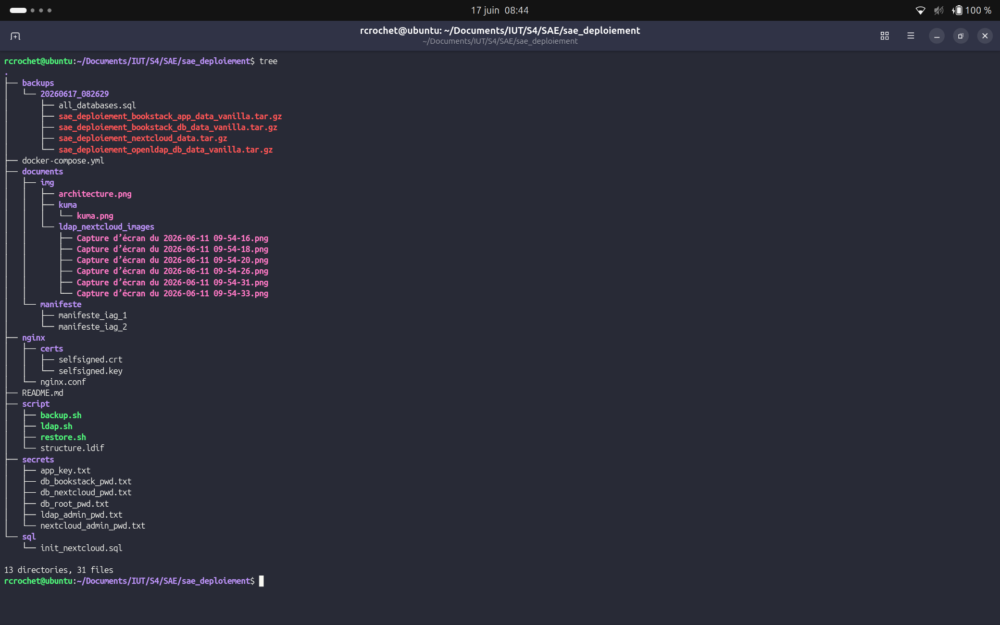
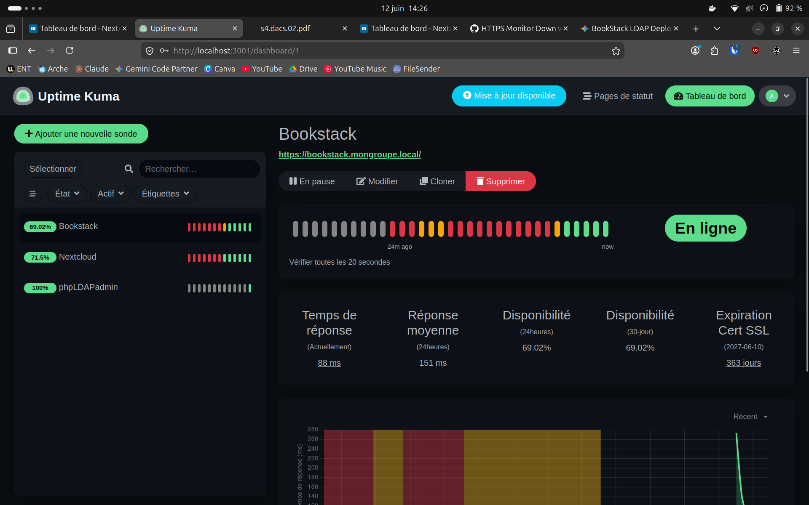

# Déploiement de BookStack et Nextcloud avec authentification SSO LDAP
**SAÉ Déploiement d’une application collaborative - Rémi Crochet et Ronan Fisson**

---

## 1. C'est quoi LDAP ?

LDAP (Lightweight Directory Access Protocol) est un protocole qui permet d'accéder à un annuaire centralisé d'utilisateurs. Concrètement, c'est ce qui permet à une entreprise d'avoir un seul compte par personne, utilisable sur toutes les applications internes — c'est le principe du SSO (Single Sign-On).

L'annuaire est organisé comme un arbre (DIT - Directory Information Tree). Chaque utilisateur est une entrée avec des attributs (nom, e-mail, identifiant...) et est identifié par un DN (Distinguished Name) unique, par exemple `uid=einstein,ou=users,dc=mongroupe,dc=local`. Pour interroger l'annuaire, on effectue d'abord un **bind** (authentification de service), puis un **search** (recherche d'entrées), et enfin un nouveau **bind** pour vérifier le mot de passe de l'utilisateur.

---

## 2. Architecture du Déploiement (Infrastructure Locale & Sécurisée)

Dans un premier temps, nous avions relié BookStack au serveur de test public `ldap.forumsys.com`. Pour garantir la sécurité, la robustesse et l'autonomie totale de notre application, nous avons fait évoluer notre infrastructure en déployant **notre propre annuaire LDAP local**, un service de Cloud (Nextcloud), et un **Reverse Proxy (Nginx)** pour sécuriser les échanges.

Nous avons structuré notre projet de manière professionnelle avec des dossiers dédiés :



Notre infrastructure orchestre désormais **7 conteneurs interconnectés** :

1. **MariaDB** : La base de données relationnelle mutualisée pour BookStack et Nextcloud (Réseau interne).
2. **OpenLDAP** : Notre serveur d'annuaire local, configuré sur `dc=mongroupe,dc=local`.
3. **BookStack** : L'application web collaborative (Isolée sur le réseau interne).
4. **Nextcloud** : Le service de stockage et de partage de fichiers (Isolé sur le réseau interne).
5. **phpLDAPadmin** : L'interface web d'administration de l'annuaire (Isolée sur le réseau interne).
6. **Nginx (Reverse Proxy)** : Le point d'entrée public de notre serveur.
7. **Uptime Kuma (Supervision)** : L'application Web de surveillance des services.

---

## 3. Reverse Proxy, Sécurité et HTTPS (Nginx)

Afin de simuler un environnement de production réaliste, nous avons déployé un proxy inverse Nginx. Son rôle est de regrouper nos services derrière un point d'entrée unique et de chiffrer les communications (HTTPS).

* **Génération des certificats SSL :** En l'absence de domaine public, nous avons généré nos propres certificats auto-signés (`openssl req -x509...`) stockés dans le dossier `nginx/certs/`.
* **Routage et Virtual Hosts :** Le fichier `nginx.conf` analyse l'URL demandée par l'utilisateur et redirige le trafic vers le bon conteneur Docker de manière transparente. Nginx force également la redirection du trafic HTTP (port 80) vers HTTPS (port 443).
* **Configuration applicative :** Les applications ont été reconfigurées pour être "conscientes" du proxy. BookStack utilise la variable `APP_URL=https://bookstack.mongroupe.local`, et Nextcloud s'appuie sur les variables `OVERWRITEPROTOCOL` et `OVERWRITEHOST` pour générer des liens sécurisés.
* **Résolution DNS Locale :** Puisque nos noms de domaine (`.local`) n'existent pas sur Internet, nous avons modifié le fichier `/etc/hosts` de la machine cliente pour assurer la résolution locale :
`127.0.0.1 bookstack.mongroupe.local nextcloud.mongroupe.local phpldapadmin.mongroupe.local`

**Accès aux services :**

* `https://bookstack.mongroupe.local`
* `https://nextcloud.mongroupe.local`
* `https://phpldapadmin.mongroupe.local`

---

## 4. Tutoriel de Déploiement

Pour garantir un déploiement propre et reproductible, voici la marche à suivre étape par étape :

1. **Démarrage de l'infrastructure :** Lancer les conteneurs en arrière-plan avec la commande :
```bash
   docker compose up -d

```

2. **Initialisation :** Patienter quelques instants que tous les services soient pleinement opérationnels (notamment le temps que MariaDB s'initialise et que Nextcloud termine son installation silencieuse).
3. **Injection de l'annuaire LDAP :** Exécuter le script dédié pour peupler l'arborescence et créer les utilisateurs de test :

```bash
   ./script/ldap.sh

```

4. **Connexion :** L'infrastructure est prête. Vous pouvez vous connecter aux différentes interfaces via votre navigateur (ex: `https://bookstack.mongroupe.local`).

---

## 5. Intégration LDAP dans Nextcloud

L'intégration de l'annuaire dans Nextcloud s'effectue via son interface d'administration, en paramétrant finement les filtres de recherche. Nous avons ajouté un dossier `img/ldap_nextcloud_images` qui permet de visualiser la configuration exacte utilisée.

* **Filtre des utilisateurs :** `(&(objectclass=inetOrgPerson))` (Permet à Nextcloud de compter le nombre d'utilisateurs humains valides dans l'annuaire).
* **Filtre de connexion :** `(&(&(objectclass=inetOrgPerson))(uid=%uid))` (Fait correspondre la saisie de l'utilisateur avec l'attribut `uid` du LDAP).
* **Attribut Nom d'utilisateur interne :** Forcé sur `uid` dans les paramètres avancés pour éviter que Nextcloud ne génère des dossiers avec des identifiants (UUID) illisibles.

---

## 6. Sauvegarde et Restauration

Afin de garantir la pérennité des données, nous avons conçu deux scripts bash (`backup.sh` et `restore.sh`).

**Sauvegarde (Backup à chaud) :**
La sauvegarde s'effectue avec l'infrastructure entièrement allumée. Le script archive les volumes et extrait un dump SQL à la volée.

> ⚠️ **Analyse critique :** Effectuer une sauvegarde globale "à chaud" de tous les volumes en même temps comporte un risque d'incohérence si une donnée est écrite au moment exact de la sauvegarde. Dans un contexte de production strict, une sauvegarde séquentielle volume par volume ou avec un arrêt temporaire des services serait préférable.

**Restauration (Restore) :**
Le script de restauration s'occupe de tout remettre en ordre automatiquement (arrêt des services, suppression des volumes corrompus, extraction des archives et redémarrage). Il est obligatoire de lui préciser le chemin du backup ciblé lors de son exécution :

```bash
sudo ./script/restore.sh ./backups/NOM_DU_BACKUP/

```

| Nom du volume | Service associé | Type de données stockées | Criticité |
| --- | --- | --- | --- |
| **`sae_deploiement_bookstack_db_data_vanilla`** | MariaDB | Bases de données relationnelles (`bookstackapp` et `nextcloud`). Contient le texte des pages, la structure des livres, et les métadonnées de Nextcloud. | **Critique (Perte inacceptable).** C'est le cœur de l'information. Sans lui, les applications sont vides. |
| **`sae_deploiement_nextcloud_data`** | Nextcloud | Fichiers physiques uploadés par les utilisateurs (documents, images), configuration système (`config.php`) et applications Nextcloud installées. | **Critique (Perte inacceptable).** Un service de Cloud perd tout son sens si les fichiers des utilisateurs disparaissent. |
| **`sae_deploiement_bookstack_app_data_vanilla`** | BookStack | Fichiers uploadés dans BookStack (images insérées dans les pages, pièces jointes) et configuration interne (`.env` généré par l'image LinuxServer). | **Critique (Perte inacceptable).** Si perdu, les pages BookStack auront des images brisées. |
| **`sae_deploiement_openldap_db_data_vanilla`** | OpenLDAP | Les données de l'annuaire (l'arbre DIT, les utilisateurs complets, les groupes et les mots de passe hachés). | **Acceptable (Reconstructible).** *Normalement critique*, mais grâce au script `start.sh` et `structure.ldif`, ce volume se recrée automatiquement. |
| **`sae_deploiement_openldap_conf_data_vanilla`** | OpenLDAP | Fichiers de configuration interne du serveur LDAP. | **Acceptable (Reconstructible).** Ces fichiers sont générés automatiquement par l'image Docker au démarrage. |

---

## 7. Supervision de l'infrastructure (Uptime Kuma)

Afin de s'assurer de la disponibilité de nos services et d'être alertés en cas de panne, nous avons déployé un conteneur dédié à la supervision : **Uptime Kuma**.

Cet outil interroge nos services en temps réel à travers notre réseau virtuel sécurisé pour vérifier qu'ils répondent correctement.

Voici un aperçu de notre tableau de bord de supervision en action :



---

## 8. Observations et Difficultés rencontrées

**1. Le filtre de recherche LDAP BookStack erroné**
Le sujet indique d'utiliser la variable `(uid=${input})`. Cependant, la documentation de BookStack attend la syntaxe `(uid=${user})`. Remplacer cette variable a résolu le problème (en n'oubliant pas de doubler le symbole `$${user}` dans le `.yml` pour l'échappement Docker).

**2. Erreur 500 : Problème de cache de l'image LinuxServer**
L'image BookStack utilise un script pour générer un fichier `.env`. S'il conserve d'anciens caches, il injecte des variables par défaut corrompues (`Access denied for user 'database_username'`). Nous avons contourné le problème en injectant directement les variables natives de Laravel (`DB_USERNAME` et `DB_PASSWORD`), court-circuitant ainsi le fichier `.env`.

**3. Les "Fantômes" Docker (Ports bloqués)**
En migrant vers l'infrastructure locale, nous avons rencontré des erreurs `bind: address already in use`. Des processus système orphelins maintenaient les ports ouverts en tâche de fond. Nous avons dû forcer la destruction des processus via la commande `kill`.

**4. Le ciblage de la base utilisateur dans Nextcloud**
Lors de la configuration LDAP dans l'interface de Nextcloud, l'application ne trouvait initialement aucun utilisateur (0 trouvé).
*Solution apportée :* Au lieu de laisser Nextcloud chercher à la racine globale de l'annuaire, nous avons explicitement renseigné le chemin de notre unité organisationnelle dans le paramètre du DN de base utilisateur : `ou=users,dc=mongroupe,dc=local`.

**5. Résolution DNS locale et sécurité des navigateurs (DoH)**
Lors de la configuration de Nginx, les domaines virtuels `.local` définis dans le fichier `/etc/hosts` de la machine n'étaient pas toujours reconnus par les navigateurs web, renvoyant une erreur "Adresse introuvable".
*Solution apportée :* La fonctionnalité "DNS over HTTPS" (DoH) de Firefox contournait le fichier `hosts` local pour interroger directement des serveurs DNS publics. Désactiver cette option dans le navigateur a rétabli le routage.

**6. Le piège des Docker Secrets selon les images**
L'implémentation des Docker Secrets nécessite une syntaxe différente selon le créateur de l'image. Les images officielles (MariaDB, Nextcloud) attendent le suffixe `_FILE` (ex: `MYSQL_PASSWORD_FILE`), tandis que les images maintenues par LinuxServer (BookStack) utilisent un format spécifique avec un double underscore en préfixe (`FILE__DB_PASS`).

**7. La condition de course (Race Condition) lors de l'auto-installation Nextcloud**
Bien que configuré pour s'installer silencieusement ("Zero-Touch"), Nextcloud démarre parfois plus vite que le temps nécessaire à MariaDB pour s'initialiser. Dans ce cas, Nextcloud échoue en silence et affiche la page d'installation manuelle par défaut.
*Solution apportée :* Effectuer un nettoyage complet du volume Nextcloud puis le redémarrer permet de relancer la tentative d'installation automatique une fois la base de données prête.

**8. Monitoring avec Uptime Kuma et l'isolement DNS Docker**
Lors du déploiement de sondes Uptime Kuma pour superviser la disponibilité de nos services, les requêtes échouaient systématiquement (`ENOTFOUND`), malgré un fonctionnement correct sur le navigateur hôte.
*Solution apportée :* Le conteneur Uptime Kuma évoluant dans son propre sous-réseau hermétique, il ignorait le fichier `hosts` local de la machine. Nous avons dû forcer la résolution DNS interne en déclarant explicitement nos noms de domaine virtuels `.local` dans les attributs réseau de Docker (`aliases`), permettant ainsi à Uptime Kuma de communiquer correctement avec le Reverse Proxy Nginx.

**9. Conflits de contexte d'exécution (`sudo` vs utilisateur) dans les scripts de sauvegarde**
Lors de l'exécution initiale du script `backup.sh` avec les droits administrateur (`sudo`), l'export SQL échouait avec l'erreur `service "mariadb" is not running`, bien que le conteneur soit actif.
*Solution apportée :* L'utilisateur `root` ne partageant pas le même environnement de projet Docker Compose que notre utilisateur courant, nous avons abandonné la commande `docker compose exec` au profit de `docker exec` couplé au nom absolu du conteneur. Cela permet au script d'interagir directement avec le moteur Docker, quel que soit l'utilisateur qui l'exécute.

**10. Plantages Bash et conflits de nommage lors de la restauration**
L'élaboration du script de restauration (`restore.sh`) a révélé des instabilités liées à la syntaxe Bash stricte et au comportement de Docker en cas de valeurs nulles (générant des arguments `-v` invalides qui faisaient planter le démon Docker). Par ailleurs, lancer `docker compose down` en mode `sudo` ne supprimait pas les anciens conteneurs, générant des conflits de nom lors de la restauration.
*Solution apportée :* Nous avons sécurisé le script en intégrant des variables de validation strictes (`if [ -z "$1" ]`) pour empêcher les exécutions à vide. Afin de garantir un environnement de restauration "Zero-Trust", nous avons codé la destruction inconditionnelle et forcée des anciens conteneurs via `docker rm -f` avant de procéder à la recréation de l'infrastructure.